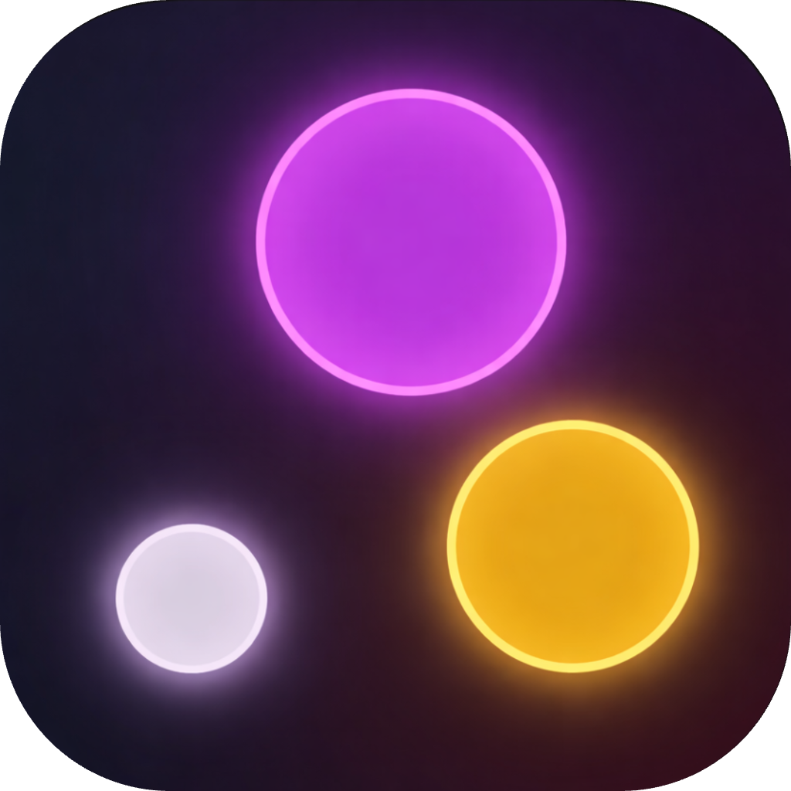
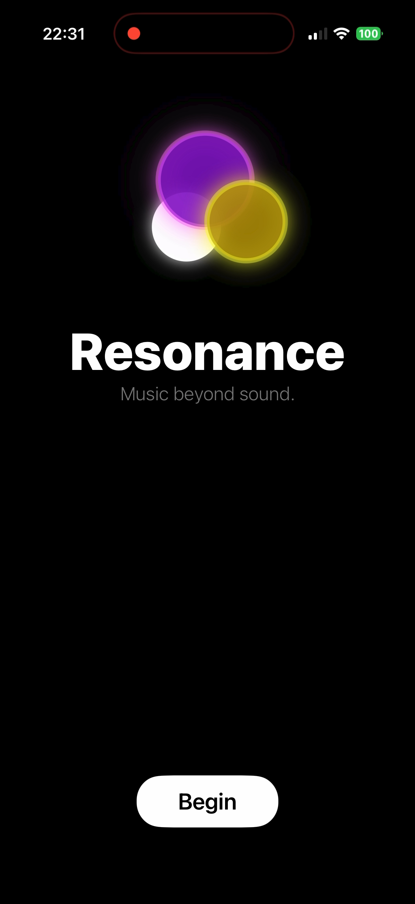
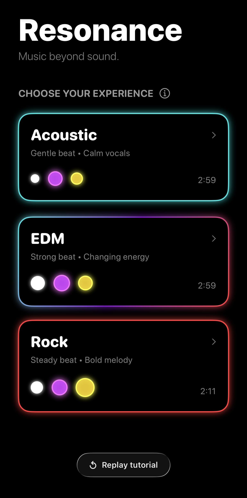

# Resonance

An iOS app that turns a song into something you feel, not just hear —
real-time haptic and visual feedback driven by what's actually happening in
the music.

<br clear="left" />

<p align="center">
  
  
</p>

## How it works

1. **Stem separation** — a source track is split into vocals, drums, bass,
   and other instrumentation.
2. **Vibe classification** — a Core ML model (`VibeClassifier.mlmodel`),
   trained on audio features extracted with `librosa`, classifies the mood of
   each 3-second window of the track (`vibe_classifier.py`).
3. **Playback** — `AudioEngine` and `PlaybackManager` play the track back in
   sync with the classified timeline.
4. **Haptics** — `HapticManager` drives CoreHaptics patterns per stem
   (vocals / kick / instrumentation), so the phone physically pulses with the
   music.
5. **Visuals** — `RenderEngine` and `VisualiserView` render a live,
   colour-shifting visualizer keyed to the same per-stem signal and the
   classified vibe.

## Stack

- SwiftUI + Combine for the app and reactive state
- CoreHaptics for real-time haptic feedback
- Core ML for on-device vibe classification
- Python (`librosa`, `coremltools`) for offline model training / feature
  extraction — not run on-device

## Project layout

```
Resonance/
  Controller/       AudioEngine, PlaybackManager, HapticManager, RenderEngine
  Model/            Song, VibeSegment, DataPoint, TextCue
  View/             ContentView, HomeView, VisualiserView, TutorialView
  VibeClassifier.mlmodel   Trained Core ML model
  vibe_classifier.py       Offline classification/labeling script
  extract_amplitude.py     Audio feature extraction
  stems/            Pre-separated stem audio for the bundled demo track
```

## Status

Prototype / personal project — not shipping. Built to explore CoreHaptics
and on-device audio ML together.

## License

MIT — see [LICENSE](LICENSE).
